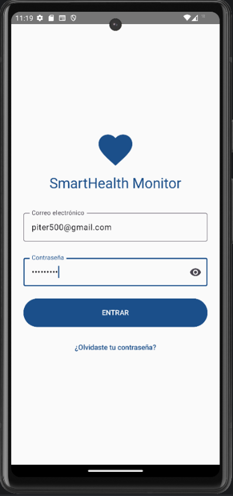
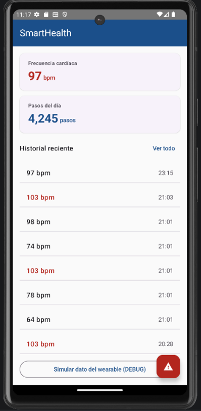
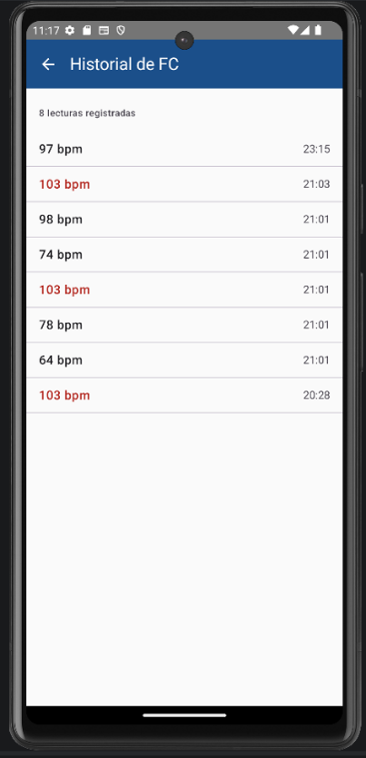
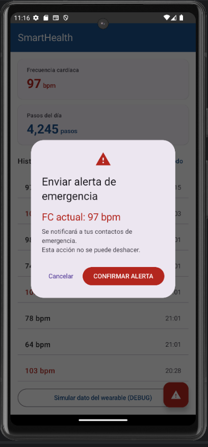
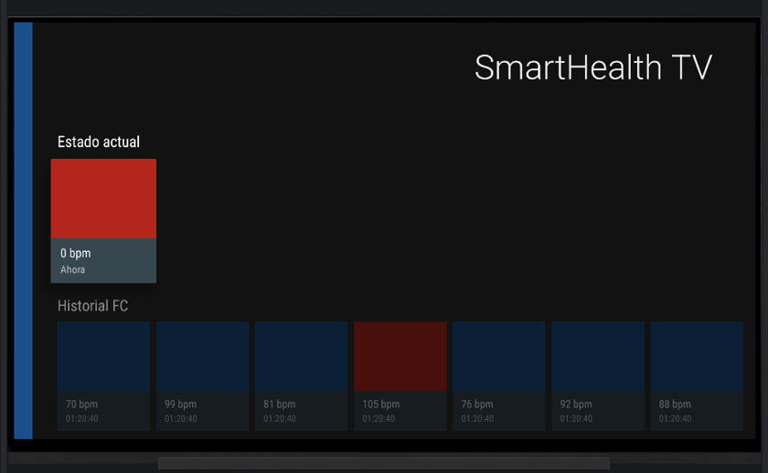
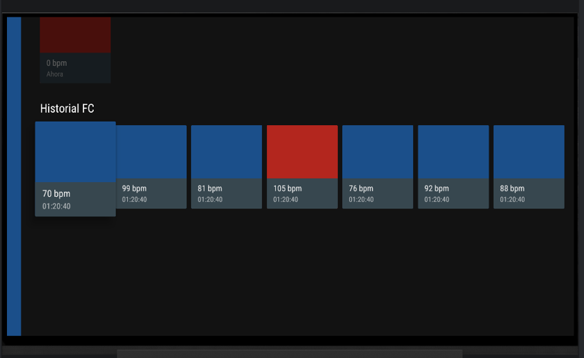
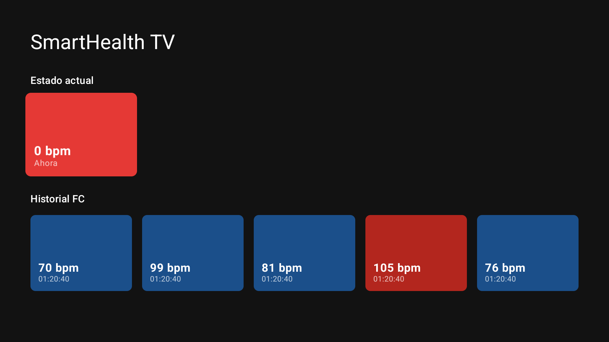
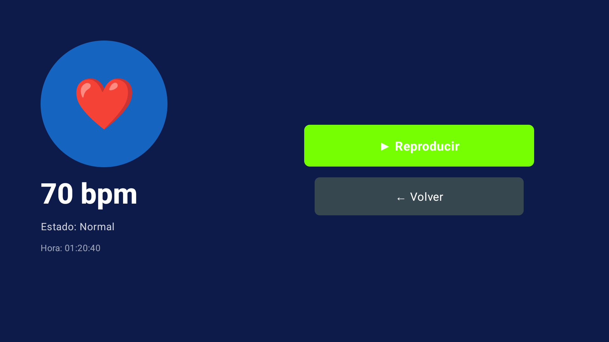
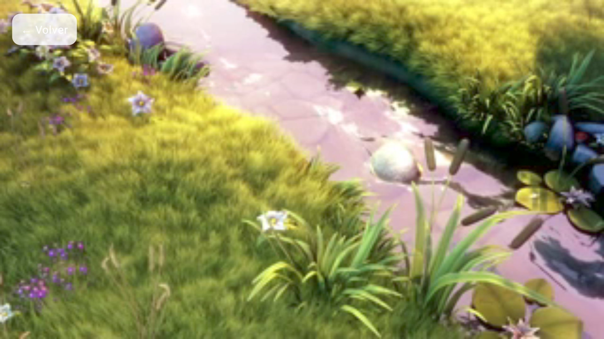

# SmartHealth Monitor


Aplicación Android de monitoreo de salud personal en tiempo real.
Desarrollada como proyecto integrador — UTNG 9° Cuatrimestre 2025.

## Stack tecnológico

| Tecnología | Uso |
| --- | --- |
| Kotlin + Jetpack Compose | UI declarativa con Material Design 3 |
| Wearable Data Layer API | Comunicación reloj → teléfono (BLE) |
| Health Services API | Sensor FC real en background (Wear OS) |
| Room Database | Historial persistente de lecturas FC |
| Jetpack Navigation | NavHost entre 4 pantallas |
| GitHub + Conventional Commits | Control de versiones profesional |

## Pantallas

| Pantalla | Descripción |
| --- | --- |
| LoginScreen | Autenticación con validación y State |
| DashboardScreen | FC y Pasos en tiempo real del wearable |
| HistorialScreen | Lecturas persistidas en Room con Flow reactivo |
| AlertaScreen | AlertDialog MD3 + Snackbar de confirmación |

## Capturas de pantalla






## Unidad II — Wear OS

| Pantalla | Descripción |
|---|---|
| WearDashboardScreen | FC en tiempo real con ScalingLazyColumn y TimeText |
| WearHistorialScreen | Lista con Rotary Input (corona del reloj) |
| WearAlertaScreen | Botones circulares de confirmación |
| SmartHealth WatchFace | Hora + FC en el WatchFace nativo |


## Unidad III — Android TV

**Sesión 11 (Leanback, superado por Compose for TV en la Sesión 12):**

| Pantalla | Descripción |
|---|---|
| MainFragment | BrowseSupportFragment con filas "Estado actual" e "Historial FC" |
| FCCardPresenter | ImageCardView con foco D-pad, color según FC normal/fuera de rango |




**Sesión 12 — Compose for TV + Navigation Compose + Media3/ExoPlayer:**

| Pantalla | Descripción |
|---|---|
| TvCatalogScreen | Catálogo en Compose for TV, reemplaza MainFragment+FCCardPresenter |
| TvDetailScreen | Detalle de la lectura (bpm/estado/hora) con foco inicial vía FocusRequester |
| TvPlaybackScreen | ExoPlayer embebido con AndroidView, liberado con DisposableEffect |





## Arquitectura — SmartHealth Monitor

```
Sensor FC (Wear OS)
      │  simulado / Health Services
      ▼
WearDataSender (wear)
      │  MessageClient (BLE)
      ▼
WearListenerService (app)
      │  SmartHealthRepository.actualizarFC()
      ▼
SmartHealthRepository (:data) ──► Room DB — SmartHealthDB (LecturaFC)
      │
      ├── StateFlow<Int> (fcFlow) ─────────────────────────────────┐
      │                                                             │
      └── Flow<List<LecturaFC>> (obtenerHistorial) ──┐              │
                                                       │              │
      ┌────────────────────────────────────────────┐ │              │
      ▼                                             ▼ ▼              ▼
DashboardViewModel (app)                       TvViewModel (tv)
      │ collectAsState()                             │ collectAsStateWithLifecycle()
      ▼                                               ▼
DashboardScreen (Compose)                     TvCatalogScreen (Compose for TV)
 ├── CastButton ──► Chromecast (Remote Playback)      ├── OK en card → TvDetailScreen
 └── "Ver todo" ──► HistorialScreen (Room)             └── ▶ Reproducir → TvPlaybackScreen (ExoPlayer)
```

## Autor

Pedro Uriel Perez Monzon — UTNG — Ing. en Desarrollo y Gestión de Software
